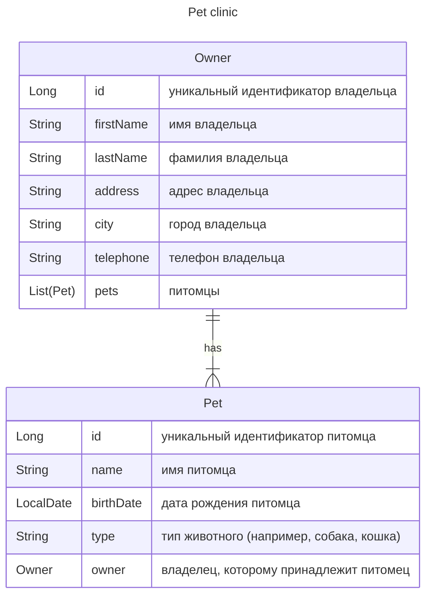
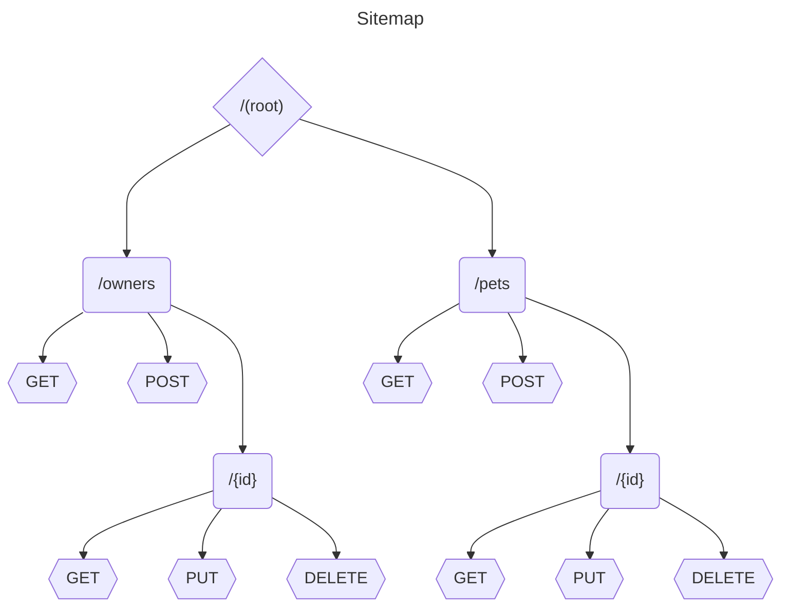

### Описание проекта

Описание проекта
Разработать REST API систему управления для ветеринарной
клиники. Система должна включать две основные
сущности: Владелец (Owner) и Питомец (Pet). Каждый
владелец может иметь множество питомцев, а каждый
питомец принадлежит только одному владельцу.


### SiteMap



### Зависимости проекта

Внутренние:
   - `org.springframework.boot:spring-boot-starter-data-jpa`
     - `org.springframework.boot:spring-boot-starter-jdbc`
     - `org.springframework.boot:spring-boot-starter-validation`
     - `org.springframework.boot:spring-boot-starter-web`
     - Runtime:
          - `com.h2database:h2`
            - ` org.postgresql:postgresql`
     - Compile:
          - `org.springframework.boot:spring-boot-configuration-processor`     
            - `org.projectlombok:lombok`
     - Test:
          - `org.springframework.boot:spring-boot-starter-test`

Внешние
   - Docker (необязательно)
   - PostgreSQL (необязательно)

Для Postgres требуется предварительно созданная и настроенная 
база данных 
1. [schema.sql](src/main/resources/schema.sql) 
2. [data.sql](src/main/resources/data.sql)

### Запуск с Postgres

Таблицы в базе автоматически **НЕ** создаются 

```shell
docker pull ghcr.io/nixiedroid/petclinic:master
docker images
docker create --name petclinic -p 8080:8086 ghcr.io/nixiedroid/petclinic:master --spring.profiles.active=psql --spring.datasource.url=jdbc:postgresql://localhost:5432/petclinic --spring.datasource.username=user --spring.datasource.password=pass --server.address=0.0.0.0
docker start petclinic
docker ps
docker attach petclinic
```

или

```shell
git clone https://github.com/nixiedroid/PetClinic.git
cd PetClinic
chmod +x ./mvnw
./mvnw -version
./mvnw spring-boot:run -Dspring-boot.run.arguments="--spring.profiles.active=psql --spring.datasource.url=jdbc:postgresql://localhost:5432/petclinic --spring.datasource.username=user --spring.datasource.password=pass --server.address=0.0.0.0 --server.port=8080"
```

### Запуск с H2

```shell
docker pull ghcr.io/nixiedroid/petclinic:master
docker images
docker create --name petclinic -p 8080:8086 ghcr.io/nixiedroid/petclinic:master --server.address=0.0.0.0
docker start petclinic
docker ps
docker attach petclinic
docker remove petclinic
```

или

```shell
git clone https://github.com/nixiedroid/PetClinic.git
cd PetClinic
chmod +x ./mvnw
./mvnw -version
 ./mvnw spring-boot:run -Dspring-boot.run.arguments="--server.address=0.0.0.0 --server.port=8080"
```

### Postman collection
[colleсtion.json](notes/PetClinic.postman_collection.json)

### Curl
```shell
curl -X GET http://localhost:8086/pets

curl -X GET http://localhost:8086/pets/1

curl -X POST http://localhost:8086/pets \
     -H "Content-Type: application/json" \
     -d '{
           "id": 5,
           "name": "Buddy",
           "birthDate": "2020-01-15",
           "type": "Dog",
           "owner": {
               "id": 1,
               "firstName": "John",
               "lastName": "Doe",
               "address": "123 Main St",
               "city": "Anytown",
               "telephone": "555-1234"
           }
         }'


curl -X PUT http://localhost:8086/pets/10 \
     -H "Content-Type: application/json" \
     -d '{
           "id": 10,
           "name": "Budddddy",
           "birthDate": "2020-01-15",
           "type": "Dog",
           "owner": {
               "id": 1,
               "firstName": "John",
               "lastName": "Doe",
               "address": "123 Main St",
               "city": "Anytown",
               "telephone": "555-1234"
           }
         }'
         
curl -X DELETE http://localhost:8086/pets/2

curl -X GET http://localhost:8086/owners

curl -X GET http://localhost:8086/owners/1

curl -X POST http://localhost:8086/owners \
     -H "Content-Type: application/json" \
     -d '{
           "id": 11,
           "firstName": "John",
           "lastName": "Doe",
           "address": "123 Main St",
           "city": "Anytown",
           "telephone": "555-1234",
           "pets": [
               {
                   "id": 1,
                   "name": "Buddy",
                   "birthDate": "2020-01-15",
                   "type": "Dog"
               }
           ]
         }'

curl -X PUT http://localhost:8086/owners/10 \
     -H "Content-Type: application/json" \
     -d '{
           "id": 10,
           "firstName": "John",
           "lastName": "Doe",
           "address": "123 Main St",
           "city": "Anytown",
           "telephone": "555-1234",
           "pets": [
               {
                   "id": 1,
                   "name": "dddf",
                   "birthDate": "2020-01-15",
                   "type": "Dog"
               }
           ]
         }'

curl -X DELETE http://localhost:8086/owners/1


```
