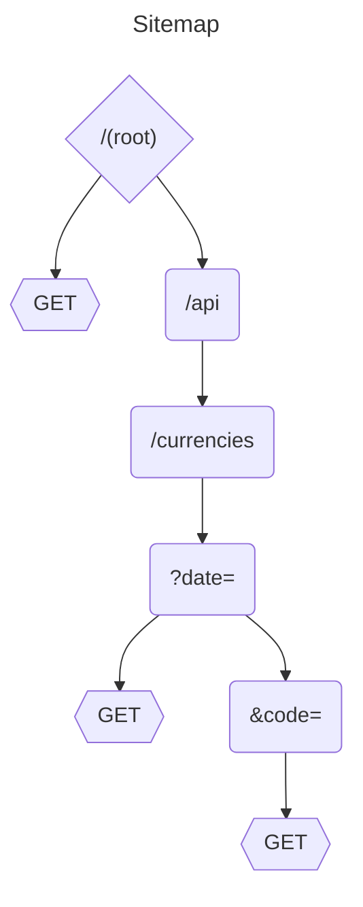

### Описание проекта
Задание: В рамках тестового задания предлагается реализовать микросервис с
использованием фреймворка Spring Boot.
Ожидаемые технологии: Spring MVC, Hibernate, Spring Data JPA, H2 Database,
Maven
Основной задачей данного микросервиса будет получение и отображение курсов
валют с сайта НБ РБ (API национального банка:
https://www.nbrb.by/apihelp/exrates).
Требуется создать 2 точки входа (endpoint) - формат данных, метод запросов,
формат ответа и набор дополнительных данных запроса/ответа определяется
разработчиком:
1. Endpoint с входящим параметром - дата.
   Результат запроса - ответ, указывающий на корректность выполнения загрузки
   данных в разработанную систему о курсах за выбранную дату.
2. Endpoint с входящими параметрами - дата и код валюты. Результат запроса -
   информация о курсе валюты за указанный день.
   Информация должна храниться во встроенной базе данных (далее БД). Создание
   БД и её сущностей должна происходить при первом старте сервиса

### SiteMap



```mermaid
---
title: NBRB uService
---


```
